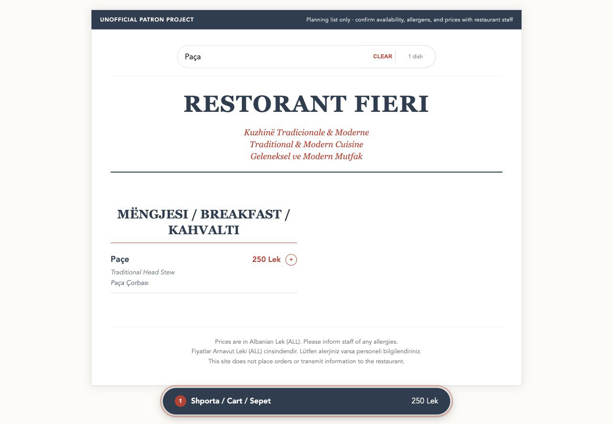
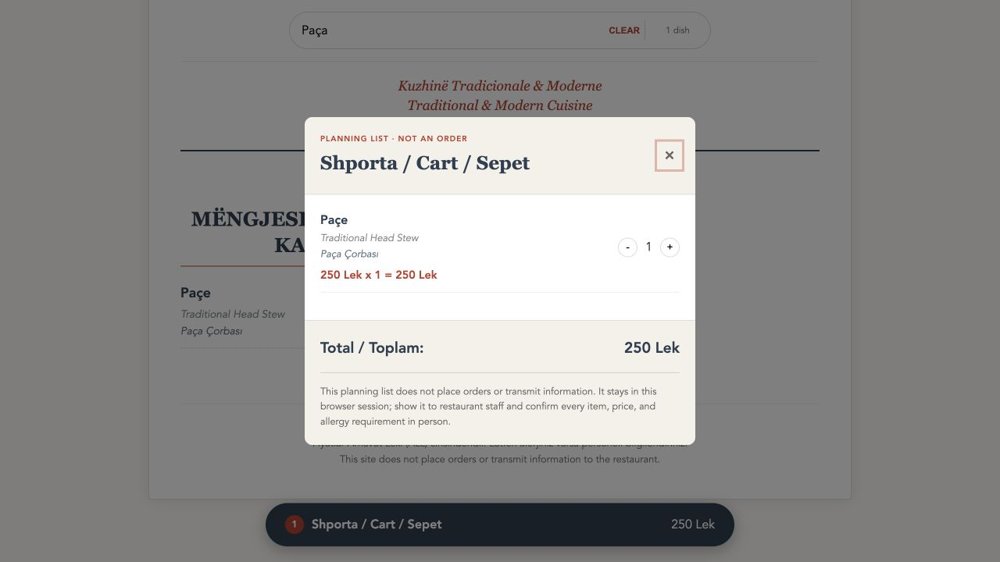

# Restorant Fieri Menu

An unofficial trilingual menu and browser-only meal-planning list created by patrons who love Restorant Fieri. Search dishes in Albanian, English, or Turkish, compare variants, and assemble a list to show restaurant staff.

**This is not an official restaurant website and it does not place orders.** Availability, ingredients, allergens, and prices must be confirmed with staff in person.

[Open the live menu](https://fieri-menu.pages.dev/)



## What it demonstrates

- Case-insensitive search across Albanian, English, Turkish, and maintained search tags.
- Honest result counts, empty-search feedback, and category headings that disappear when no child item matches.
- Variant-aware planning-list identity, quantity updates, removal at zero, and exact Lek totals.
- A named modal dialog with initial focus, contained Tab navigation, Escape closing, backdrop closing, background scroll locking, and focus restoration.
- Explicit planning-only, price-staleness, allergy, and non-affiliation boundaries in the live interface.
- Responsive and print-specific layouts with reduced-motion handling.



## Product boundary

The planning list lives only in React memory for the current browser session. It is not persisted, synchronized, submitted, or transmitted to the restaurant. There is no checkout or kitchen integration. The interface deliberately asks visitors to show the list to staff and reconfirm every item.

Menu content is maintained in `src/data/menuData.js` from publicly available information and may become stale. The daily section describes possible dishes, not guaranteed availability.

## Architecture

- `menuData.js` is the single menu-content source for standard and daily sections.
- `menu-search.js` owns the shared multilingual matching rule used by both result counts and rendered sections.
- `CartProvider` owns variant-aware entries, quantities, totals, and dialog state.
- Focus and scroll lifecycle stay inside `CartModal`; menu rendering remains split across small presentational components.

## Verification

The behavior suite drives the public labels to prove multilingual search, result/reset states, accurate planning-list arithmetic, dialog semantics, focus entry, and Escape restoration. CI runs those checks before lint and the production build.

```bash
npm ci
npm test
npm run lint
npm run build
```

## Reuse status

This repository does not currently include a standalone license file. Any licensing decision remains with the repository owner.
